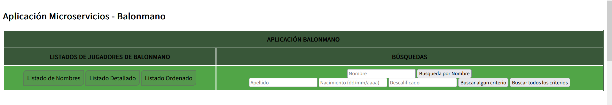
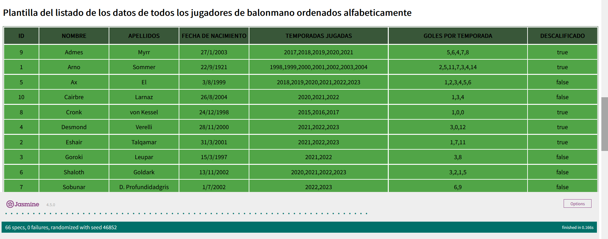
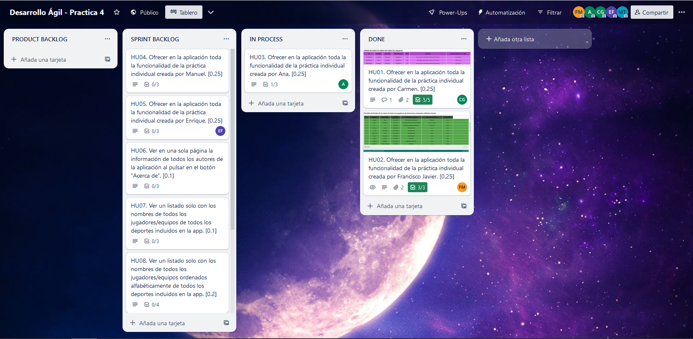
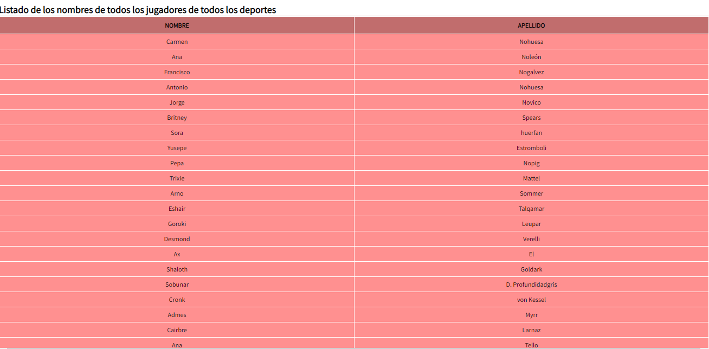
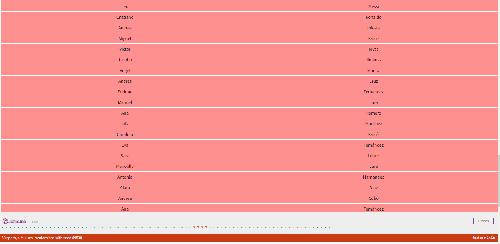
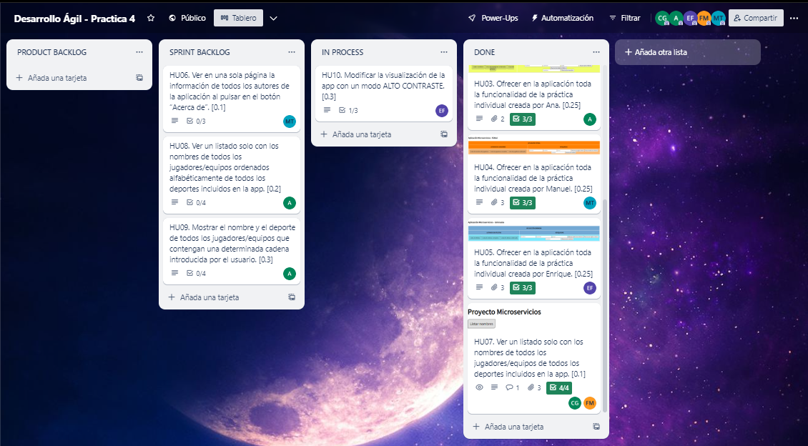

[](https://classroom.github.com/a/hCaQWL7N)
[](https://classroom.github.com/online_ide?assignment_repo_id=10906934&assignment_repo_type=AssignmentRepo)

# **Práctica 4**

* Trello: https://trello.com/b/vTlpqkXG/desarrollo-ágil-practica-4
* GitHub: https://github.com/UJA-DAGIL-22-23/d-agil-2022-2023-practica-4-ana_carmen_enrique_franciscoj_manuel

# *Datos del equipo*

## Estudiante 1:
- **Nombre y apellidos**: Carmen Huesa Guardiola
- **Correo Electronico**: chg00016@red.ujaen.es
- **Deporte**: Tiro con arco

## Los documentos de la bases de datos:

### **1º Arquera**
```
{
    "nombre": "Carmen",
    "apellido": "Nohuesa",
    "id": "77670913Y",
    "nacionalidad": "Española",
    "edad": 24,
    "disparo": {
      "tipo_de_arco": "Arco recurvo",
      "distancia_de_tiro": "30 metros",
      "tipo_de_flecha": "flecha de madera"
    },
    "puntuaciones_de_la_tanda": [5, 5, 7, 3, 8, 6]
}
  ```

###  **2º Arquera**
  ```
  {
    "nombre": "Ana",
    "apellido": "Noleón",
    "edad": 20,
    "id": "45630413J",
    "nacionalidad": "Española",
    "disparo": {
      "tipo_de_arco": "Arco largo",
      "distancia_de_tiro": "100 metros",
      "tipo_de_flecha": "flecha de carbono"
    },
    "puntuaciones_de_la_tanda": [8, 8, 2, 7, 4, 6]
}
  ```

###  **3º Arquero**
```
{
    "nombre": "Francisco",
    "apellido": "Nogalvez",
    "edad": 38,
    "id": "1428945F",
    "nacionalidad": "Francesa",
    "disparo": {
      "tipo_de_arco": "Arco compuesto",
      "distancia_de_tiro": "50 metros",
      "tipo_de_flecha": "flecha de aluminio"
    },
    "puntuaciones_de_la_tanda": [2, 2, 9, 10, 6, 6]
}
  ```

###  **4º Arquero**
```
{
    "nombre": "Antonio",
    "apellido": "Nohuesa",
    "edad": 18,
    "id": "43670993G",
    "nacionalidad": "Española",
    "disparo": {
      "tipo_de_arco": "Arco recurvo",
      "distancia_de_tiro": "30 metros",
      "tipo_de_flecha": "flecha de aluminio"
    },
    "puntuaciones_de_la_tanda": [6, 5, 8, 4, 8, 7]
}
  ```

###   **5º Arquero**
  ```
{
    "nombre": "Jorge",
    "apellido": "Novico",
    "edad": 68,
    "id": "97654765P",
    "nacionalidad": "Alemana",
    "disparo": {
      "tipo_de_arco": "Arco largo",
      "distancia_de_tiro": "110 metros",
      "tipo_de_flecha": "flecha de madera"
    },
    "puntuaciones_de_la_tanda": [1, 10, 0, 10, 7, 6]
}
  ```

###   **6º Arquera**
```
{
    "nombre": "Britney",
    "apellido": "Spears",
    "edad": 50,
    "id": "34984985L",
    "nacionalidad": "Norte Americana",
    "disparo": {
      "tipo_de_arco": "Arco compuesto",
      "distancia_de_tiro": "70 metros",
      "tipo_de_flecha": "flecha de carbono"
    },
    "puntuaciones_de_la_tanda": [9, 8, 9, 7, 7, 7]
}
```

###  **7º Arquero**
```
{
    "nombre": "Sora",
    "apellido": "huerfan",
    "edad": 18,
    "id": "80065988D",
    "nacionalidad": "Suiza",
    "disparo": {
      "tipo_de_arco": "Arco recurvo",
      "distancia_de_tiro": "20 metros",
      "tipo_de_flecha": "flecha de aluminio"
    },
    "puntuaciones_de_la_tanda": [3, 4, 3, 2, 8, 5]
}
```

###  **8º Arquero**
```
{
    "nombre": "Yusepe",
    "apellido": "Estromboli",
    "edad": 49,
    "id": "17804632K",
    "nacionalidad": "Italiana",
    "disparo": {
      "tipo_de_arco": "Arco largo",
      "distancia_de_tiro": "150 metros",
      "tipo_de_flecha": "flecha de carbono"
    },
    "puntuaciones_de_la_tanda": [5, 4, 3, 9, 2, 3]
}
```

###  **9º Arquera**
```
{
    "nombre": "Pepa",
    "apellido": "Nopig",
    "edad": 25,
    "id": "22328865P",
    "nacionalidad": "Francesa",
    "disparo": {
      "tipo_de_arco": "Arco recurvo",
      "distancia_de_tiro": "12 metros",
      "tipo_de_flecha": "flecha de madera"
    },
    "puntuaciones_de_la_tanda": [0, 1, 6, 4, 6, 2]
}
```

###   **10º Arquera**
```
{
    "nombre": "Trixie",
    "apellido": "Mattel",
    "edad": 37,
    "id": "99090546G",
    "nacionalidad": "Norte Americana",
    "disparo": {
      "tipo_de_arco": "Arco compuesto",
      "distancia_de_tiro": "50 metros",
      "tipo_de_flecha": "flecha de carbono"
    },
    "puntuaciones_de_la_tanda": [6, 6, 10, 9, 3, 3]
}
```

## Estudiante 2:
- **Nombre y apellidos**: Francisco Javier Gálvez Marín
- **Correo Electronico**: fjgm0038@red.ujaen.es
- **Deporte**: Balonmano

## Los documentos de la bases de datos:
### **1º Jugador**
```{
  playerId: 1,
  name: "Arno",
  surname: "Sommer",
  dateBirth: {
    day: 22,
    month: 9,
    year: 1921
  },
  seasonsPlayed: [1998, 1999, 2000, 2001, 2002, 2003, 2004],
  goalSeason: [2, 5, 11, 7, 3, 4, 14],
  disqualified: true
}
```
### **2º Jugador**
```
{
  playerId: 2,
  name: "Eshair",
  surname: "Talqamar",
  dateBirth: {
    day: 31,
    month: 3,
    year: 2001
  },
  seasonsPlayed: [2021, 2022, 2023],
  goalSeason: [1, 7, 11],
  disqualified: true
}
```
### **3º Jugador**
```
{
  playerId: 3,
  name: "Goroki",
  surname: "Leupar",
  dateBirth: {
    day: 15,
    month: 3,
    year: 1997
  },
  seasonsPlayed: [2021, 2022],
  goalSeason: [3, 8],
  disqualified: false
}
```
### **4º Jugador**
```
{
  playerId: 4,
  name: "Desmond",
  surname: "Verelli",
  dateBirth: {
    day: 28,
    month: 11,
    year: 2000
  },
  seasonsPlayed: [2021, 2022, 2023],
  goalSeason: [3, 0, 12],
  disqualified: true
}
```
### **5º Jugador**
```
{
  playerId: 5,
  name: "Ax",
  surname: "El",
  dateBirth: {
    day: 3,
    month: 8,
    year: 1999
  },
  seasonsPlayed: [2018, 2019, 2020, 2021, 2022, 2023],
  goalSeason: [1, 2, 3, 4, 5, 6],
  disqualified: false
}
```
### **6º Jugador**
```
{
  playerId: 6,
  name: "Shaloth",
  surname: "Goldark",
  dateBirth: {
    day: 13,
    month: 11,
    year: 2002
  },
  seasonsPlayed: [2020, 2021, 2022, 2023],
  goalSeason: [3, 2, 1, 5],
  disqualified: false
}
```
### **7º Jugador**
```
{
  playerId: 7,
  name: "Sobunar",
  surname: "D. Profundidadgris",
  dateBirth: {
    day: 1,
    month: 7,
    year: 2002
  },
  seasonsPlayed: [2022, 2023],
  goalSeason: [6, 9],
  disqualified: false
}
```
### **8º Jugador**
```
{
  playerId: 8,
  name: "Cronk",
  surname: "von Kessel",
  dateBirth: {
    day: 24,
    month: 12,
    year: 1998
  },
  seasonsPlayed: [2015, 2016, 2017],
  goalSeason: [1, 0, 0],
  disqualified: true
}
```
### **9º Jugador**
```
{
  playerId: 9,
  name: "Admes",
  surname: "Myrr",
  dateBirth: {
    day: 27,
    month: 1,
    year: 2003
  },
  seasonsPlayed: [2017, 2018, 2019, 2020, 2021],
  goalSeason: [5, 6, 4, 7, 8],
  disqualified: true
}
```
### **10º Jugador**
```
{
  playerId: 10,
  name: "Cairbre",
  surname: "Larnaz",
  dateBirth: {
    day: 26,
    month: 8,
    year: 2004
  },
  seasonsPlayed: [2020, 2021, 2022],
  goalSeason: [1, 3, 4],
  disqualified: false
}
```
## Estudiante 3:
- **Nombre y apellidos**: Ana León Pulido
- **Correo Electrónico**: alp00054@red.ujaen.es
- **Deporte**: Motonaútica

## Los documentos de la bases de datos:

### **1º Piloto**
```
{
  "ref": Ref(Collection("Pilotos"), "359810309521670348"),
  "ts": 1680272907585000,
  "data": {
    "nombre": "Ana",
    "apellido": "Tello",
    "edad": 27,
    "motos": {
      "nombre": "Jet Ski",
      "plazas": "1 persona",
      "peso": 150
    },
    "playasvisitadas": [
      "Ses Illetes",
      "Bolonia",
      "Catedrales"
    ]
  }
}
  ```

###  **2º Piloto**
  ```
  {
  "ref": Ref(Collection("Pilotos"), "359810552909791436"),
  "ts": 1679400952740000,
  "data": {
    "nombre": "Juan",
    "apellido": "Yeguas",
    "edad": 23,
    "motos": {
      "nombre": "Runabout",
      "plazas": "4 personas",
      "peso": 216
    },
    "playasvisitadas": [
      "Cala Macarella",
      "Macarelleta",
      "Valdevaqueros"
    ]
  }
}
  ```

###  **3º Piloto**
```
{
  "ref": Ref(Collection("Pilotos"), "359810690659123404"),
  "ts": 1679401064450000,
  "data": {
    "nombre": "Nuria",
    "apellido": "Pulido",
    "edad": 38,
    "motos": {
      "nombre": "Runabout",
      "plazas": "4 personas",
      "peso": 216
    },
    "playasvisitadas": [
      "Papagayo",
      "Cofete",
      "Rodas"
    ]
  }
}
  ```

###  **4º Piloto**
```
{
  "ref": Ref(Collection("Pilotos"), "359810788904403149"),
  "ts": 1679401158200000,
  "data": {
    "nombre": "Francisco",
    "apellido": "Amezcua",
    "edad": 54,
    "motos": {
      "nombre": "Jet Ski",
      "plazas": "1 persona",
      "peso": 150
    },
    "playasvisitadas": [
      "Torimbia",
      "Cala Saona",
      "Catedrales"
    ]
  }
}
  ```

###  **5º Piloto**
  ```
{
  "ref": Ref(Collection("Pilotos"), "359810864228860109"),
  "ts": 1679401229980000,
  "data": {
    "nombre": "Victor",
    "apellido": "Lechuga",
    "edad": 37,
    "motos": {
      "nombre": "Jet Ski",
      "plazas": "1 persona",
      "peso": 150
    },
    "playasvisitadas": [
      "La Concha",
      "Bolonia",
      "Maspalomas"
    ]
  }
}
  ```

###  **6º Piloto**
```
{
  "ref": Ref(Collection("Pilotos"), "359811054744633548"),
  "ts": 1679401411670000,
  "data": {
    "nombre": "Dereck",
    "apellido": "Archilla",
    "edad": 20,
    "motos": {
      "nombre": "Runabout",
      "plazas": "4 personas",
      "peso": 216
    },
    "playasvisitadas": [
      "Punta Paloma",
      "La Arnía",
      "Silencio"
    ]
  }
}
```

###  **7º Piloto**
```
{
  "ref": Ref(Collection("Pilotos"), "360724982393733325"),
  "ts": 1680273001010000,
  "data": {
    "nombre": "Paco",
    "apellido": "Nerea",
    "edad": 68,
    "motos": {
      "nombre": "Jet Ski",
      "plazas": "1 persona",
      "peso": 150
    },
    "playasvisitadas": [
      "Bolonia",
      "Tulum",
      "Maui"
    ]
  }
}
```

###  **8º Piloto**
```
{
  "ref": Ref(Collection("Pilotos"), "360725180782215373"),
  "ts": 1680602808210000,
  "data": {
    "nombre": "Marta",
    "apellido": "Mata",
    "edad": 22,
    "motos": {
      "nombre": "Runabout",
      "plazas": "4 personas",
      "peso": 216
    },
    "playasvisitadas": [
      "Santa Monica",
      "Mykonos",
      "Sarakiniko"
    ]
  }
}
```

###  **9º Piloto**
```
{
  "ref": Ref(Collection("Pilotos"), "360725302631989453"),
  "ts": 1680273306410000,
  "data": {
    "nombre": "Mario",
    "apellido": "Quesada",
    "edad": 58,
    "motos": {
      "nombre": "Jet Ski",
      "plazas": "1 persona",
      "peso": 150
    },
    "playasvisitadas": [
      "Oludeniz",
      "Mykonos",
      "Cala Macarelleta"
    ]
  }
}
```

###  **10º Piloto**
```
{
  "ref": Ref(Collection("Pilotos"), "360725403916042445"),
  "ts": 1680273403003000,
  "data": {
    "nombre": "Olivia",
    "apellido": "Jurado",
    "edad": 29,
    "motos": {
      "nombre": "Runabout",
      "plazas": "4 personas",
      "peso": 216
    },
    "playasvisitadas": [
      "Palolem",
      "Bora Bora",
      "Silencio"
    ]
  }
}
```

## Estudiante 4:
- **Nombre y apellidos**: Manuel Lara Torres
- **Correo Electrónico**: mlt00024@red.ujaen.es
- **Deporte**: Fútbol

## Los documentos de la bases de datos:

### **1º Jugador**
```
{
  nombre: "Leo",
  apellidos: "Messi",
  fnac: {
    dia: 21,
    mes: 7,
    anio: 1987
  },
  equipos: ["F.C Barcelona", "Paris Saint-Germain F.C."],
  goles: 701
}
```
### **2º Jugador**
```
{
  nombre: "Cristiano",
  apellidos: "Ronaldo",
  fnac: {
    dia: 28,
    mes: 12,
    anio: 1985
  },
  equipos: [
    "Sporting C.P.",
    "Manchester United F.C.",
    "Real Madrid C.F.",
    "Juventus F.C.",
    "Al-Nassr F.C."
  ],
  goles: 801
}
```
### **3º Jugador**
```
{
  nombre: "Andres",
  apellidos: "Iniesta",
  fnac: {
    dia: 7,
    mes: 8,
    anio: 1984
  },
  equipos: ["F.C. Barcelona", "Vissel Kobe F.C."],
  goles: 433
}
```
### **4º Jugador**
```
{
  nombre: "Miguel",
  apellidos: "Garcia",
  fnac: {
    dia: 23,
    mes: 9,
    anio: 1991
  },
  equipos: ["Jaen F.C.", "Linares Dptvo"],
  goles: 123
}
```
### **5º Jugador**
```
{
  nombre: "Victor",
  apellidos: "Rivas",
  fnac: {
    dia: 8,
    mes: 12,
    anio: 2000
  },
  equipos: ["UJA F.C."],
  goles: 1000
}
```
### **6º Jugador**
```
{
  nombre: "Jacobo",
  apellidos: "Jimenez",
  fnac: {
    dia: 28,
    mes: 2,
    anio: 2002
  },
  equipos: ["JavaScript F.C."],
  goles: 0
}
```
### **7º Jugador**
```
{
  nombre: "Angel",
  apellidos: "Muñoz",
  fnac: {
    dia: 8,
    mes: 12,
    anio: 2000
  },
  equipos: ["Matematicas F.C."],
  goles: 98
}
```
### **8º Jugador**
```
{
  nombre: "Andres",
  apellidos: "Cruz",
  fnac: {
    dia: 1,
    mes: 1,
    anio: 1979
  },
  equipos: ["SQL F.C."],
  goles: 0
}
```
### **9º Jugador**
```
{
  nombre: "Enrique",
  apellidos: "Fernandez",
  fnac: {
    dia: 6,
    mes: 1,
    anio: 2001
  },
  equipos: ["Criptos F.C.", "Real MSC S.A.D."],
  goles: 145
}
```
### **10º Jugador**
```
{
  nombre: "Manuel",
  apellidos: "Lara",
  fnac: {
    dia: 21,
    mes: 7,
    anio: 2002
  },
  equipos: ["Discreta F.C.", "EEDD F.C.", "Desarrollo Agil F.C."],
  goles: 327
}
```

## Estudiante 5:
- **Nombre y apellidos**: Enrique Fernández Fernández
- **Correo Electrónico**: eff00007@red.ujaen.es
- **Deporte**: Gimasia Rítmica

## Los documentos de la bases de datos:

### **1º Atleta**
```
{
  nombre: "Ana",
  apellido: "Romero",
  edad: 22,
  dni: "01234567H",
  medallas: [2018],
  direccion: {
    calle: "Calle A",
    numero: "123",
    ciudad: "Sevilla",
    pais: "España"
  },
  rankingMundial: 19
}
```
### **2º Atleta**
```
{
  nombre: "Julia",
  apellido: "Martinez",
  edad: 22,
  dni: "45624956D",
  medallas: [2018],
  direccion: {
    calle: "Calle B",
    numero: "2353",
    ciudad: "Jaén",
    pais: "España"
  },
  rankingMundial: 23
}
```
### **3º Atleta**
```
{
  nombre: "Carolina",
  apellido: "García",
  edad: 24,
  dni: "54567043B",
  medallas: [2012, 2016],
  direccion: {
    calle: "Calle C",
    numero: "456",
    ciudad: "Barcelona",
    pais: "España"
  },
  rankingMundial: 8
}
```
### **4º Atleta**
```
{
  nombre: "Eva",
  apellido: "Fernández",
  edad: 22,
  dni: "56034564C",
  medallas: [2016],
  direccion: {
    calle: "Calle D",
    numero: "332",
    ciudad: "Valencia",
    pais: "España"
  },
  rankingMundial: 12
}
```
### **5º Atleta**
```
{
  nombre: "Sara",
  apellido: "López",
  edad: 1043,
  dni: "33224183V",
  medallas: [2018],
  direccion: {
    calle: "Calle E",
    numero: "1",
    ciudad: "Andujar",
    pais: "España"
  },
  rankingMundial: 18
}
```
### **6º Atleta**
```
{
  nombre: "Manolillo",
  apellido: "Lara",
  edad: 2,
  dni: "12345432B",
  medallas: [2012, 2016, 2020],
  direccion: {
    calle: "Calle F",
    numero: "5214",
    ciudad: "Andujar",
    pais: "España"
  },
  rankingMundial: 1
}
```
### **7º Atleta**
```
{
  nombre: "Ana",
  apellido: "Fernández",
  edad: 27,
  dni: "54306754H",
  medallas: [2020, 2022],
  direccion: {
    calle: "Calle B",
    numero: "2",
    ciudad: "Barcelona",
    pais: "España"
  },
  rankingMundial: 4521
}
```
### **8º Atleta**
```
{
  nombre: "Antonio",
  apellido: "Hernandez",
  edad: 20,
  dni: "34520954J",
  medallas: [2014],
  direccion: {
    calle: "Calle F",
    numero: "6",
    ciudad: "Madriz",
    pais: "España"
  },
  rankingMundial: 14
}
```
### **9º Atleta**
```
{
  nombre: "Clara",
  apellido: "Díaz",
  edad: 26,
  dni: "56673985F",
  medallas: [2010, 2014, 2018],
  direccion: {
    calle: "Calle G",
    numero: "4",
    ciudad: "Valencia",
    pais: "España"
  },
  rankingMundial: 6
}
```
### **10º Atleta**
```
{
  nombre: "Andrea",
  apellido: "Cobo",
  edad: 21,
  dni: "54326798R",
  medallas: [2012, 2014],
  direccion: {
    calle: "Calle E",
    numero: "5673",
    ciudad: "Jaén",
    pais: "España"
  },
  rankingMundial: 5467
}
```

# *Capturas de Trello al inicio:*
En PRODUCT BACKLOG se encuentran todas las historias de usuario que se van a implementar. Estas pasan al sprint backlog al inicio del sprint.
<br></br>

<br></br>
En esta imagen queda reflejado dicho proceso.
<br></br>


# *Historias de usuario elegidas a implementar:* 
* HU01. Ofrecer en la aplicación toda la funcionalidad de la práctica individual creada por Carmen.
* HU02. Ofrecer en la aplicación toda la funcionalidad de la práctica individual creada por Francisco Javier.
* HU03. Ofrecer en la aplicación toda la funcionalidad de la práctica individual creada por Ana.
* HU04. Ofrecer en la aplicación toda la funcionalidad de la práctica individual creada por Manuel.
* HU05. Ofrecer en la aplicación toda la funcionalidad de la práctica individual creada por Enrique.
* HU06. Ver en una sola página la información de todos los autores de la aplicación al pulsar en el botón “Acerca de”.
* HU07. Ver un listado solo con los nombres de todos los jugadores/equipos de todos los deportes incluidos en la app.
* HU08. Ver un listado solo con los nombres de todos los jugadores/equipos ordenados alfabéticamente de todos los deportes incluidos en la app.
* HU09. Mostrar el nombre y el deporte de todos los jugadores/equipos que contengan una determinada cadena introducida por el usuario. (Por ejemplo, si el usuario introduce “EST” se mostrarán todos los nombres junto con el deporte practicado de todos los jugadores/equipos cuyo nombre incluya “EST”).
* HU10. Modificar la visualización de la app con un modo ALTO CONTRASTE.


## HU01. Ofrecer en la aplicación toda la funcionalidad de la práctica individual creada por Carmen
Implementada por Carmen Huesa Guardiola

Para implementar toda la funcionalidad de mi práctica individual he tenido que:

-Modificaciones en front-end
* Añadir la carpeta front-end de mi práctica indivual al repositorio para realizar las modificaciones a partir de ella.
* Añadir mis ficheros ms-tiro_con_arco.js y ms-tiro_con_arco-spec.js en la carpeta js.
* Cambiar el nombre de todas las funciones del ms-tiro_con_arco.js para que al llamarlas en el index.html no provoque ningún problema con las llamadas de mi equipo.
* Cambiar el nombre de las definiciones de unos parametros en ms-tiro_con_arco-spec.js para que no genere problemas con los de mi equipo.
* Modificar el fichero ms-plantilla.css de la carpeta css para llamarlo ms-tiro_con_arco.css.
* En ms-tiro_con_arco.css crear tablas de color morado para mejorar la visualización de mi funcionalidad, tanto de los botones como de las listas resultantes de pulsarlos.
* Cargar mis ficheros ms-tiro_con_arco.css, ms-tiro_con_arco.js y ms-tiro_con_arco-spec.js en index.html.
* Modificar la presentación de mi microservicio en index.html.

-Modificaciones en api-gateway
* Añadir la carpeta api-gateway de mi práctica indivual al repositorio para realizar las modificaciones a partir de ella.
* Añadir a proxy-routes.js mi ruta.
* Añadir a proxy-routes.js las rutas de mis compañeros de equipo, con un puerto distinto a cada uno.

-Modificaciones en ms-tiro_con_arco (anteriormente ms-plantilla en la práctica individual)
* Añadir la carpeta ms-tiro_con_arco al proyecto.
* Cambiar el nombre ms-plantilla por ms-tiro_con_arco tanto en package.json como en package-lock.json

-Modificaciones en assests
* Subir las capturas de mi funcionalidad en img.

La siguiente captura muestra el estado de Trello una vez terminada la historia de usuario.


En estas capturas muestro la funcionalidad de mi microservicio. La primera muestra los distintos botones tanto para mostras las listas como los de búsqueda.


Esta segunda, muestra el resultado de hacer una búsqueda por algún criterio, siendo el criterio por el que buscar de entre los arqueros que tengan nacionalidad española.


<br></br>

## HU02. Ofrecer en la aplicación toda la funcionalidad de la práctica individual creada por Fran
Implementada por Francisco Javier Gálvez Marín

Para implementar la HU 02, he tenido que implementar mi ms-plantilla de la práctica anterior, para ello he realizado las siguientes moficicaciones:

- Modificaciones en front-end
  * Añadir los ficheros ms-balonmano.js y ms-balonmano-spec.js en la carpeta js.
  * Cambiar el nombre de todas las funciones de ms-balonmano.js para que cuando sean llamadas en index.html no cause conflicto ningún problema con las llamadas de los otros microservicios. Además Plantilla ahora se llama BalonmanoJugador.
  * Cambiar los spec en ms-balonmano-spec.js para adaptarse y reflejar los cambios anteriores.
  * Añadido el fichero ms-balonmano.css.
  * Modificar los contenidos de ms-balonmano.css para que los colores sean diferentes a los del resto de microservicios, en este caso tomando diferentes tonalidades de verde.
  * Cargar los ficheros ms-balonmano.css, ms-balonmano.js y ms-balonmano-spec.js en index.html.
  * Modificada la presentación del microservicio de balonmano en index.html, incluyendo los cambios en el nombre de Plantilla a BalonmanoJugador y de las variables para que tengan nombres únicos que no coincidan con el resto de microservicios.

- Modificaciones en api-gateway
  * Carmen cambió el número de la ruta de este microservicio mientras realizaba el cambio del suyo

- Modificaciones en ms-balonmano (anteriormente ms-plantilla en la práctica individual)
  * Añadir la carpeta ms-balonmano al proyecto.
  * Cambiar el nombre ms-plantilla por ms-balonmano tanto en package.json como en package-lock.json

- Modificaciones en assests
  * Capturas subidas de la funcionalidad y el trello.

En estas capturas se muestran la funcionalidad de este microservicio. La primera muestra los distintos botones y 
búsqueda dentro de la nueva tabla mientras que la segunda captura muestra la lista de todos los jugadores de 
balonmano ordenados alfabéticamente como ejemplo de que las diferentes funcionalidades operan correctamente. 
Finalmente está la captura de trello en el instante en el que esta HU pasó de IN PROCESS a DONE




<br></br>

## HU03. Ofrecer en la aplicación toda la funcionalidad de la práctica individual creada por Ana
Implementada por Ana León Pulido

Para implementar la HU03, he tenido que implementar mi ms-plantilla de la práctica anterior, para ello he realizado las siguientes moficicaciones:

- Modificaciones en front-end
  * Añadir los ficheros ms-motonautica.js y ms-motonautica-spec.js en la carpeta js.
  * Cambiar el nombre de las funciones de ms-motonautica.js para que al ser llamadas no cause ningún problema con las llamadas de los otros microservicios. Además la Plantilla ahora se llama motonautica.
  * Cambiar los spec en ms-motonautica-spec.js para adaptarse y reflejar los cambios anteriores.
  * Añadido el fichero ms-motonautica.css.
  * Modificar los contenidos de ms-motonautica.css para que los colores sean diferentes a los del resto de microservicios, en mi caso he utilizado el color amarillo.
  * Cargar los ficheros ms-motonautica.css, ms-motonautica.js y ms-motonautica-spec.js en index.html.
  * Modificada la presentación del microservicio de motonautica en index.html, incluyendo los cambios en el nombre de Plantilla a motonautica y de las variables para que tengan nombres únicos que no coincidan con el resto de microservicios.

- Modificaciones en api-gateway
  * Carmen cambió el número de la ruta de este microservicio mientras realizaba el cambio del suyo

- Modificaciones en ms-motonautica (anteriormente ms-plantilla en la práctica individual)
  * Añadir la carpeta ms-motonautica al proyecto.
  * Cambiar el nombre ms-plantilla por ms-motonautica tanto en package.json como en package-lock.json

- Modificaciones en assests
  * Capturas subidas de la funcionalidad y el trello.

En estas capturas se muestran la funcionalidad de este microservicio. 

La primera captura muestra la barra de búsqueda e la que se probaran las distintas funcionalidades: 


La segunda captura muestra una funcionalidad siendo probada, todas funcionan:


Finalmente está la captura de trello en el instante en el que esta HU pasó de IN PROCESS a DONE:


<br></br>

## HU04. Ofrecer en la aplicación toda la funcionalidad de la práctica individual creada por Manuel
Implementada por Manuel Lara Torres

Para implementar la HU04, he tenido que implementar mi ms-plantilla de la práctica anterior, para ello he realizado las siguientes moficicaciones:

- Modificaciones en front-end
  * Añadir los ficheros ms-futbol.js y ms-futbol-spec.js en la carpeta js.
  * Cambiar el nombre de las funciones de ms-futbol.js para que al ser llamadas no cause ningún problema con las llamadas de los otros microservicios. Además la Plantilla ahora se llama futbol.
  * Cambiar los spec en ms-futbol-spec.js para adaptarse y reflejar los cambios anteriores.
  * Añadido el fichero ms-futbol.css.
  * Modificar los contenidos de ms-futbol.css para que los colores sean diferentes a los del resto de microservicios, en mi caso he utilizado el color naranja.
  * Cargar los ficheros ms-futbol.css, ms-futbol.js y ms-futbol-spec.js en index.html.
  * Modificada la presentación del microservicio de futbol en index.html, incluyendo los cambios en el nombre de Plantilla a futbol y de las variables para que tengan nombres únicos que no coincidan con el resto de microservicios.

- Modificaciones en api-gateway
  * Carmen cambió el número de la ruta de este microservicio mientras realizaba el cambio del suyo

- Modificaciones en ms-futbol (anteriormente ms-plantilla en la práctica individual)
  * Añadir la carpeta ms-futbol al proyecto.
  * Cambiar el nombre ms-plantilla por ms-futbol tanto en package.json como en package-lock.json

- Modificaciones en assests
  * Capturas subidas de la funcionalidad y el trello.

En estas capturas se muestran la funcionalidad de este microservicio. 

La primera captura muestra la barra de búsqueda e la que se probaran las distintas funcionalidades: 


La segunda captura muestra una funcionalidad de listado siendo probada, todas funcionan:


La segunda captura muestra una funcionalidad de busqueda siendo probada, todas funcionan:


Finalmente está la captura de trello en el instante en el que esta HU pasó de IN PROCESS a DONE:


<br></br>

## HU05. Ofrecer en la aplicación toda la funcionalidad de la práctica individual creada por Enrique

Implementada por Enrique Fernández Fernández

Para implementar la HU05, he tenido que implementar mi ms-plantilla de la práctica anterior, para ello he realizado las siguientes moficicaciones:

- Modificaciones en front-end
  * Añadir los ficheros ms-gimnasia.js y ms-gimnasia-spec.js en la carpeta js.
  * Cambiar el nombre de las funciones de ms-gimnasia.js para que al ser llamadas no cause ningún problema con las llamadas de los otros microservicios. Además la Plantilla ahora se llama gimnasia.
  * Cambiar los spec en ms-gimnasia-spec.js para adaptarse y reflejar los cambios anteriores.
  * Añadido el fichero ms-gimnasia.css.
  * Modificar los contenidos de ms-gimnasia.css para que los colores sean diferentes a los del resto de microservicios, en mi caso he utilizado el color amarillo.
  * Cargar los ficheros ms-gimnasia.css, ms-gimnasia.js y ms-gimnasia-spec.js en index.html.
  * Modificada la presentación del microservicio de gimnasia en index.html, incluyendo los cambios en el nombre de Plantilla a gimnasia y de las variables para que tengan nombres únicos que no coincidan con el resto de microservicios.

- Modificaciones en api-gateway
  * Carmen cambió el número de la ruta de este microservicio mientras realizaba el cambio del suyo

- Modificaciones en ms-gimnasia (anteriormente ms-plantilla en la práctica individual)
  * Añadir la carpeta ms-gimnasia al proyecto.
  * Cambiar el nombre ms-plantilla por ms-gimnasia tanto en package.json como en package-lock.json

- Modificaciones en assests
  * Capturas subidas de la funcionalidad y el trello.

En estas capturas se muestran la funcionalidad de este microservicio. 

La primera captura muestra la barra de búsqueda e la que se probaran las distintas funcionalidades: 


La segunda captura muestra la funcionalidad de la lista ordenada:


La tercera captura muestra la funcionalidad de la lista completa:


Finalmente está la captura de trello en el instante en el que esta HU pasó de IN PROCESS a DONE:


<br></br>

## HU06. Ver en una sola página la información de todos los autores de la aplicación al pulsar en el botón “Acerca de”
## HU07. Ver un listado solo con los nombres de todos los jugadores/equipos de todos los deportes incluidos en la app
Implementada por Carmen Huesa Guardiola y Francisco Javier Gálvez Marín

- Modificaciones en front-end
  * Para implementar esta HU hemos creado dos nuevos archivos en la carpeta js llamados ms-general.js y su correspondiente ms-general-spec.js.
  * En ms-general.js hemos creado _generalTags_ que sirve para identificar de el nombre y apellidos de los jugadores de cada una de las bases de datos.
  * Hemos creado una tabla con cuerpo llamado _cuerpoNombres_ y cabecera llamada _cabeceraNombres_ para que muestre los nombre y apellidos.
  * Implementada las funciones que actualizan los jugadores con la tabla.
  * También, hemos implementado una función que sustituye los tags por cada deporte.
  * La función _recupera_ que carga todos los jugadores de los diferentes microservicios.
  * Por último, hemos creado la función _imprimeSoloNombres_ que llama a las funciones de actualizar para que se puedan ver en la página los nombres y apellidos de los jugadores y _procesarListaNombre_ que es la función que llamaremos desde index.html.
  * En ms-general-spec nos aseguramos de que se asignen correctamente los valores al sustituir los tags y que _imprimeSoloNombres_ funcione correctamente.
  * ms-general incluye todas las funciones necesarias para llamar a todos los microservicios y recibir los jugadores.
  * El ms-general se llama así de forma provisional, el que sea un microservicio finalmente o no dependerá del desarrollo de las otras HU.
  * Creamos ms-general.css para que la lista resultante de nombre y apellido se muestre mejor.

En la siguiente captura se puede ver el botón para esta nueva funcionalidad.
    

Las dos capturas a continuación muestran el principio y final de la nueva lista (no hemos hecho captura de los datos intermedios por comodidad) que incluye a los 50 jugadores de todos los microservicios del proyecto. Los spec que se puede apreciar que fallan es porque hemos aprovechado para preparar el que será necesario para la funcionalidad HU06 que implementaremos posteriormente.
    
    

Finalmente tenemos una captura que muestra el estado del tablero trello al finalizar esta HU
    

<br></br>

## HU08. Ver un listado solo con los nombres de todos los jugadores/equipos ordenados alfabéticamente de todos los deportes incluidos en la app


## HU09. Mostrar el nombre y el deporte de todos los jugadores/equipos que contengan una determinada cadena introducida por el usuario. 
Implementada por Carmen Huesa Guardiola y Francisco Javier Gálvez Marín

- Modificaciones en front-end
  * En ms-general.js hemos añadido un tag adicional llamado DEPORTE que sirve para identificar de que MS viene cada jugador. 
  * Hemos creado una cabecera y cuerpo nuevos para mostrar adecuadamente este nuevo tag
  * Hemos adaptado las funciones ya implementadas que sustituían tags para funcionar con el nuevo tag DEPORTE según de que ms provenga
  * Implementada una nueva función que actualiza los jugadores con el nuevo cuerpo (y por tanto el deporte).
  * Implementada la función _recuperaCadena_ que carga todos los jugadores de los diferentes microservicios, tras esto busca la cadena deseada en los apellidos y nombres de los jugadores, con lo que se filtran aquellos que cumplan el requisito. Tras lo que se llama a la función _imprimeBusca_. Importante, se diferencia entre mayúsculas y minúsculas a la hora de buscar la cadena.
  * Implementada la función _imprimeBusca_ que llama al nuevo actualizar mencionado anteriormente para que se puedan ver en la página los jugadores buscados.
  * En ms-general-spec.js hemos creado los spec correspondientes a las nuevas funciones. Actualizando los antiguos para comprobar que las funciones de sustitución operan adecuadamente con el nuevo tag.
  * En index.html se ha implementado la barra de búsqueda y botón correspondiente a esta nueva HU.

La siguiente captura muestra el estado de Trello una vez terminada la historia de usuario.


En estas capturas muestramos la funcionalidad de mi microservicio. La primera muestra la barra de búsqueda junto con su botón para mostras las lista.


Esta segunda, muestra el resultado de hacer una búsqueda por la cadena de caracteres 'no'.


<br></br>

## HU10. Modificar la visualización de la app con un modo ALTO CONTRASTE